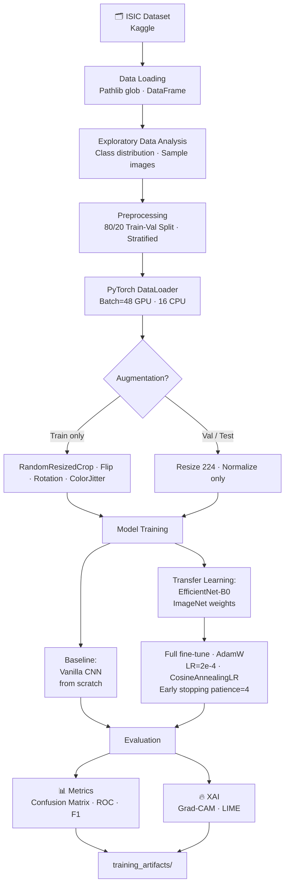
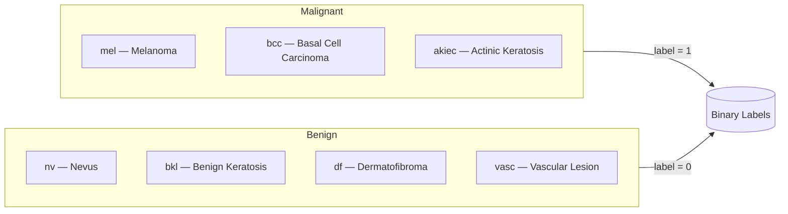
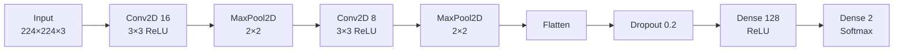
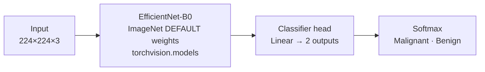
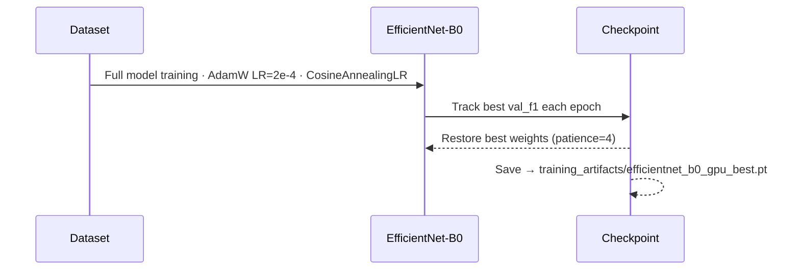
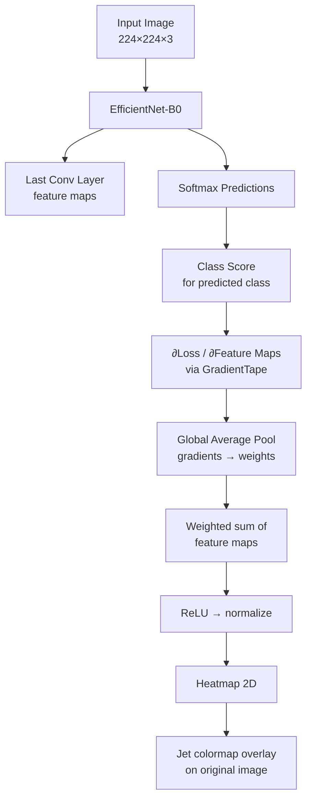
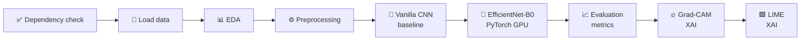
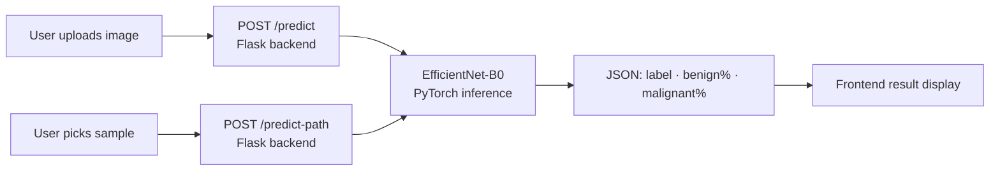

# Skin Cancer Classification — Transfer Learning + Explainable AI

<div align="center">


**Binary skin lesion classification using Transfer Learning and Explainable AI.**  
Classifies dermoscopy images as *Malignant* or *Benign* with interpretable Grad-CAM heatmaps.

</div>

---

## Table of Contents

- [Overview](#overview)
- [Pipeline Architecture](#pipeline-architecture)
- [Dataset](#dataset)
- [Model Architecture](#model-architecture)
- [Training Strategy](#training-strategy)
- [Explainability — Grad-CAM & LIME](#explainability--grad-cam--lime)
- [Results](#results)
- [Project Structure](#project-structure)
- [Setup & Usage](#setup--usage)
- [Web App](#web-app)
- [Tech Stack](#tech-stack)

---

## Overview

This project tackles the binary classification of skin lesion images into **Malignant** vs **Benign** categories using:

- **Transfer Learning** — EfficientNet-B0 pretrained on ImageNet, fine-tuned on the ISIC dermoscopy dataset
- **Baseline Comparison** — Vanilla CNN trained from scratch to benchmark against the transfer learning approach
- **Explainable AI (XAI)** — Grad-CAM heatmaps and LIME explanations to identify which skin regions drive predictions
- **PyTorch GPU training** — Full fine-tune with AdamW + CosineAnnealingLR + mixed-precision (AMP)

Early detection of malignant skin lesions can be life-saving. This system aims to assist dermatologists by providing not just a prediction, but a visual explanation grounded in the image pixels.

---

## Pipeline Architecture



---

## Dataset

| Split | Benign | Malignant | Total |
|-------|--------|-----------|-------|
| Train | 1,440  | 1,197     | 2,637 |
| Test  | 360    | 300       | 660   |

**Source:** [ISIC Skin Cancer Dataset (9 classes)](https://www.kaggle.com/datasets/nodoubttome/skin-cancer9-classesisic) on Kaggle.

The 9 original ISIC classes are mapped to a binary label:



Images are organized locally as:
```
data/
├── train/
│   ├── benign/       (1,440 images)
│   └── malignant/    (1,197 images)
└── test/
    ├── benign/       (360 images)
    └── malignant/    (300 images)
```

---

## Model Architecture

### Baseline — Vanilla CNN (TensorFlow/Keras)

A lightweight custom CNN trained from scratch as a performance baseline.



| Parameter | Value |
|-----------|-------|
| Total params | ~2.99M |
| Optimizer | Adam (lr=1e-3) |
| Loss | Categorical Crossentropy |
| Epochs | 50 (early stopping) |
| Saved as | `training_artifacts/vanilla_cnn_model.keras` |

---

### Transfer Learning — EfficientNet-B0 (PyTorch)

EfficientNet-B0 uses **compound scaling** to jointly scale depth, width, and resolution, offering superior accuracy-per-parameter compared to VGG or ResNet baselines. Trained with PyTorch using GPU acceleration.



| Parameter | Value |
|-----------|-------|
| Base model | EfficientNet-B0 (`torchvision.models`) |
| Input size | 224 × 224 × 3 |
| Head | `Linear(1280 → 2)` replacing default classifier |
| Optimizer | AdamW (lr=2e-4, weight_decay=1e-4) |
| Scheduler | CosineAnnealingLR (T_max=12) |
| Loss | CrossEntropyLoss with class weights |
| Early stopping | patience = 4 on val F1 |
| Max epochs | 18 |
| Saved as | `training_artifacts/efficientnet_b0_gpu_best.pt` |

---

## Training Strategy



**Data augmentation** is applied only during training to improve generalization:
- `RandomResizedCrop(224, scale=0.75–1.0)`
- `RandomHorizontalFlip` + `RandomVerticalFlip`
- `RandomRotation(25°)`
- `ColorJitter` (brightness, contrast, saturation ±15%)
- `Normalize` with EfficientNet ImageNet mean/std

---

## Explainability — Grad-CAM & LIME

### Grad-CAM

Gradient-weighted Class Activation Mapping (**Grad-CAM**) uses the gradients flowing into the last convolutional layer to produce a spatial heatmap highlighting the discriminative regions the model attended to.



Output per image: **Original | Grad-CAM Heatmap | Overlay** — saved to `training_artifacts/`.

### LIME

**LIME** (Local Interpretable Model-agnostic Explanations) perturbs superpixel segments of the image and fits a local linear model to explain individual predictions — complementing Grad-CAM with segment-level attribution.

---

## Results

### Model Comparison

| Metric | Vanilla CNN | EfficientNet-B0 (GPU) |
|--------|:-----------:|:---------------------:|
| Test Accuracy | 81.4% | **88.6%** |
| Precision | 74.4% | **84.8%** |
| Recall | 90.0% | **91.3%** |
| F1 Score | 81.4% | **87.9%** |
| MCC | 0.642 | **0.774** |
| AUC (ROC) | 0.908 | **0.960** |
| Parameters | ~2.99M | ~4.05M |
| Interpretability | Grad-CAM | Grad-CAM + LIME |

> Detailed metrics and predictions are saved in `training_artifacts/`.

### Output Artifacts

| Artifact | Location |
|----------|----------|
| EfficientNet-B0 model (PyTorch GPU) | `training_artifacts/efficientnet_b0_gpu_best.pt` |
| Vanilla CNN model (Keras) | `training_artifacts/vanilla_cnn_model.keras` |
| EfficientNet-B0 test metrics | `training_artifacts/efficientnet_b0_gpu_test_metrics.csv` |
| EfficientNet-B0 test predictions | `training_artifacts/efficientnet_b0_gpu_test_predictions.csv` |
| EfficientNet-B0 training history | `training_artifacts/efficientnet_b0_gpu_history.csv` |
| Vanilla CNN test metrics | `training_artifacts/vanilla_cnn_test_metrics.csv` |
| Vanilla CNN training history | `training_artifacts/vanilla_cnn_training_history.csv` |
| Model comparison metrics | `training_artifacts/model_comparison_metrics.csv` |
| Label mapping | `training_artifacts/label_mapping.json` |

---

## Project Structure

```
skin-cancer-efficientnet-xai/
│
├── 📓 skin_cancer_TL_CNN.ipynb          ← Main project notebook (self-contained)
│
├── 📁 data/                              Dataset (populate before running)
│   ├── train/
│   │   ├── benign/      (1,440 images)
│   │   └── malignant/   (1,197 images)
│   └── test/
│       ├── benign/      (360 images)
│       └── malignant/   (300 images)
│
├── 📁 training_artifacts/               All training outputs
│   ├── efficientnet_b0_gpu_best.pt      EfficientNet-B0 trained model (PyTorch)
│   ├── vanilla_cnn_model.keras          Vanilla CNN trained model (Keras)
│   ├── efficientnet_b0_gpu_history.csv  EfficientNet training history
│   ├── vanilla_cnn_training_history.csv Vanilla CNN training history
│   ├── efficientnet_b0_gpu_test_metrics.csv
│   ├── efficientnet_b0_gpu_test_predictions.csv
│   ├── vanilla_cnn_test_metrics.csv
│   ├── model_comparison_metrics.csv     Side-by-side model comparison
│   └── label_mapping.json
│
├── 📁 webapp/                           Interactive web application
│   ├── app.py                           Flask backend (inference API)
│   └── static/
│       └── index.html                   Frontend UI
│
├── 📄 requirements.txt                  Python dependencies
└── 📄 README.md
```

---

## Setup & Usage

### 1. Install Dependencies

```bash
pip install -r requirements.txt
```

**`requirements.txt`** includes:
```
tensorflow>=2.13,<2.19
numpy
pandas
matplotlib
seaborn
scikit-learn
pillow
kagglehub
```

### 2. Prepare the Dataset

Ensure the following folder structure exists (images already present locally):

```
data/train/benign/
data/train/malignant/
data/test/benign/
data/test/malignant/
```

Or download from Kaggle:
```bash
pip install kagglehub
python -c "import kagglehub; kagglehub.dataset_download('nodoubttome/skin-cancer9-classesisic')"
```

### 3. Run the Notebook

Open and run **`skin_cancer_TL_CNN.ipynb`** cell by cell in Jupyter or VS Code.

The notebook is fully self-contained and covers:



### 4. Outputs

All outputs are automatically saved to `training_artifacts/`:
- **EfficientNet-B0 model** → `training_artifacts/efficientnet_b0_gpu_best.pt`
- **Vanilla CNN model** → `training_artifacts/vanilla_cnn_model.keras`
- **Metrics & predictions** → `training_artifacts/*.csv`
- **Model comparison** → `training_artifacts/model_comparison_metrics.csv`

---

## Web App

An interactive web application is included for real-time inference using the trained EfficientNet-B0 model.

### Features

- **Upload any image** — drag & drop or browse, classify instantly
- **Sample test images** — browse 8 random benign + 8 random malignant images from `data/test/`, click to auto-classify
- **Probability bars** — shows confidence for both benign and malignant classes
- **Ground truth badge** — for sample images, shows the true label and whether the model was correct
- **Model metrics panel** — displays live accuracy, AUC, F1, and recall from training artifacts

### Running the Web App

```bash
pip install flask flask-cors torchvision
python webapp/app.py
```

Then open **http://127.0.0.1:5000** in your browser.



### API Endpoints

| Endpoint | Method | Description |
|----------|--------|-------------|
| `/` | GET | Serves the web UI |
| `/predict` | POST | Classify an uploaded image file |
| `/predict-path` | POST | Classify a server-side sample image by path |
| `/samples` | GET | Returns 8 random images per class from `data/test/` |
| `/image` | GET | Serves a local image for preview |
| `/metrics` | GET | Returns model comparison metrics JSON |

---

## Tech Stack

| Component | Tool / Library |
|-----------|---------------|
| Language | Python 3.10+ |
| Deep Learning (EfficientNet) | PyTorch + torchvision |
| Deep Learning (Baseline CNN) | TensorFlow 2.13+ / Keras |
| Pretrained Model | EfficientNet-B0 (`EfficientNet_B0_Weights.DEFAULT`) |
| GPU Training | CUDA via `torch.amp.autocast` + `GradScaler` |
| Data Pipeline | PyTorch `DataLoader` + `torchvision.transforms` |
| XAI — Grad-CAM | Manual `tf.GradientTape` implementation |
| XAI — LIME | `lime` + `scikit-image` |
| Evaluation | `scikit-learn` (confusion matrix, ROC, F1, MCC) |
| Visualization | Matplotlib · Seaborn |
| Dataset | ISIC via `kagglehub` |
| Web App Backend | Flask + flask-cors |
| Web App Frontend | Vanilla HTML / CSS / JavaScript |
| Notebook | Jupyter / VS Code |

---

## How Grad-CAM Works — Visually

```
Input Image          Grad-CAM Heatmap        Overlay
┌─────────────┐      ┌─────────────┐      ┌─────────────┐
│             │      │  ░░░▓▓▓██   │      │  ░░░▓▓▓██   │
│  skin       │  ──► │  ░▓▓████▓   │  ──► │  blended    │
│  lesion     │      │  ░░▓▓███░   │      │  image      │
│             │      │  ░░░░░░░░   │      │             │
└─────────────┘      └─────────────┘      └─────────────┘
                     red = high attention  jet colormap
```

Darker red regions indicate the areas the model weighted most heavily when making its malignant/benign decision — enabling clinicians to verify the model is attending to the lesion itself, not background artifacts.

---

<div align="center">
<sub>Built with PyTorch · TensorFlow · EfficientNet-B0 · Grad-CAM · LIME · Flask · ISIC Dataset</sub>
</div>
